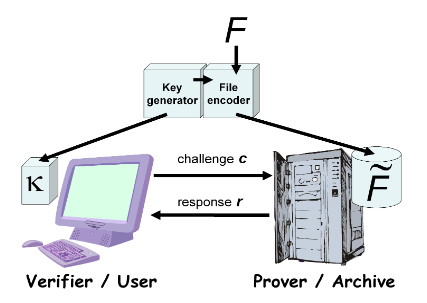

# 针对大文件的可检索性证明

## 摘要

在本文中，我们定义和探索可检索性（POR）。 POR方案使归档或备份服务（证明者）能够生成简明的证据，证明用户（验证者）可以检索目标文件F，即归档保留并可靠地传输足以供用户恢复的文件数据 $F$ 完整。

POR可以被视为一种加密的知识证明（POK），但是专门设计用于处理大文件（或位串）$F$。 我们在这里探讨POR协议，其中通信成本，证明器的存储器访问次数和用户（验证器）的存储要求是小参数，基本上与F的长度无关。除了提出新的，实用的POR结构，我们 探索与之前探索过的相关方案相关的实施注意事项和优化。

在POR中，与POK不同，证明者和验证者都不需要实际知道F. POR会产生新的和不寻常的安全定义，其定义是我们工作的另一个贡献。

我们将POR视为半可信在线档案的重要工具。 现有的加密技术可帮助用户确保他们检索的文件的隐私性和完整性。 然而，对于用户来说，想要验证档案在检索之前不删除或修改文件也是很自然的.POR的目标是完成这些检查而无需用户自己下载文件。 POR还可以提供服务质量保证，即显示文件在特定时间范围内可检索

## 1. 简介

一些趋势是向新形式的外包开放计算系统，即将计算服务委托给外部实体。 提高网络带宽和可靠性可减少用户对本地资源的依赖。 能源和劳动力成本以及计算系统复杂性正在阻碍硬件的集中管理。 用户越来越多地将数千英里之外的软件和数据用在他们自己不拥有的机器上。 网格计算，将不同的机器利用到统一的计算平台，多年来一直在科学计算中发挥作用。 同样，软件即服务（SaaS） - 松散地回归到终端/大型机计算架构 - 现在是主要公司的互联网技术战略的支柱。

存储也不例外包趋势。 消费者和企业都有在线数据备份服务。 例如，亚马逊简单存储服务（S3）[1]提供了一个抽象的在线存储接口，允许程序员通过网络服务调用访问数据对象，费用以千兆字节为单位计算，数据传输量也是如此。 研究人员已经研究了替代服务模型，例如P2P数据存储[12]。

随着用户和企业开始依赖各种数据存储库集，服务保证和底层硬件完整性的可变性，他们将需要新形式的数据完整性和可访问性保证。 简单复制为更高保证的数据归档提供了一条途径，但往往是不必要且不可持续的高成本。 （事实上，IDC最近的一份报告表明数据生成速度超过了存储可用性[14]。）像Rabin的数据分散方案[33]这样的协议更有效：它们在多个存储库之间共享数据，冗余最小，并确保数据的可用性 给定存储库的法定数量（k-out-of-n）的完整性的数据。 但是，这些协议并不能保证个别存储库的状态 - 这是一个限制协议可以为依赖方提供保证的缺点。

在本文中，我们开发了一种新的加密构建块，称为可检索性证明（POR）。 POR使用户（验证者）能够确定存档（证明者）“拥有”文件或数据对象F。更确切地说，成功执行的POR向验证者保证证明者提供协议接口，验证者可以通过该协议接口检索F的完整性。 当然，即使在成功参与POR之后，证明者也可以拒绝释放F. 但是，POR可以最大限度地保证文件可检索性，从而禁止证明者行为的变化。

正如我们在本文中所展示的那样，POR可以足够高效地提供文件可检索性的定期检查。 因此，作为一般工具，POR可以补充和加强各种归档架构中的任何一种，包括那些涉及数据分散的架构。

### 1.1 第一种方法

为了说明POR的基本思想和操作，值得考虑一个涉及键控散列函数 $h_{\kappa}(F)$ 的直接设计。 在该方案中，在存储文件 $F$ 之前，验证者计算并存储散列值 $r=h_{\kappa}(F)$ 以及秘密随机密钥 $\kappa$。 为了检查证明者是否拥有 $F$，验证者发送 $\kappa$ 并要求证明者计算并返回 $r$。 如果他对第二前映像攻击有抵抗力，这个简单的协议提供了证明者知道 $F$ 的有力证据。通过在不同的密钥上存储多个散列值，验证者可以启动多个独立的检查。

然而，这种密钥哈希方法具有重要的缺点：高资源成本。 密钥哈希协议要求验证者在其要执行的检查的数量中存储线性的多个哈希值。 该特征与使验证者能够减轻其存储负担的目的相冲突。 更重要的是，每个协议调用都要求证明者处理整个文件 $F$。对于大文件 $F$，即使像散列这样的计算轻量级操作也会非常麻烦。 此外，它要求证明者为每个证明读取整个文件 - 对于存档而言，其预期负载仅是每个文件偶尔读取的一个重要开销，每个文件都要经常测试。

### 1.2 我们的方法

我们引入了一种POR协议，其中验证器仅存储单个加密密钥（无论其寻求验证的可检索性的文件的大小和数量）以及每个文件的少量动态（几十位）。 （我们协议的一个简单变体允许存储没有动态状态，但产生较弱的安全性。）我们的方案要求证明者只访问（大）文件F的一小部分 POR的过程。 实际上，证明者“触及”的部分基本上与 $F$ 的长度无关，并且在典型的参数化中，将仅包括数百或数千个数据块。

简而言之，我们的POR协议加密 $F$ 并随机嵌入一组称为哨兵的随机值检查块。 这里使用加密使得哨兵与其他文件块无法区分。 验证者通过指定一组哨兵的位置并要求证明者返回相关的哨兵值来挑战证明者。 如果证明者修改或删除了 $F$ 的大部分，那么很有可能它也会抑制一些哨兵。 因此，不太可能正确地对验证者做出响应。 为了防止 $F$ 的一小部分证明者作恶，我们还使用纠错码。 我们让 $\tilde{F}$ 引用与证明器一起存储的完整编码文件。

我们提出的POR方案的缺点是在使用证明器存储之前所需的F的预处理/编码。 此步骤会产生一些计算开销 - 超出简单加密或散列的计算开销 - 以及证明器上的更大存储要求。 哨兵可以构成编码 $F$ 的一小部分（通常，例如，$2％$）; 错误编码占用了大量的存储开销。 但是，对于大文件和实际协议参数化，相关的扩展因子$|\tilde{F}|/|F|$ 可以相当适中，例如15％。

图1. POR系统的示意图。 编码算法将原始文件转换为编码文件 $F$ 以与证明者/档案一起存储。 密钥生成算法产生由验证者存储的密钥 $\kappa$ 并用于编码。 （在我们的主要方案中，密钥 $\kappa$ 在某些POR中独立于 $F$。）验证者执行质询 - 响应协议，证明者检查验证者是否可以检索 $F​$。

为了更好地说明我们的POR协议，我们给出了两个简短的示例场景。

*示例1* 假设证明者在接收到编码文件 $\tilde{F}$ 时破坏三个随机选择的比特，$\beta_1$，$\beta_2$，$\beta_3$。 这些位不太可能驻留在哨兵中，后者构成 $\tilde{F}$ 的一小部分。因此，验证者可能无法通过POR执行检测到损坏。 然而，由于 $\tilde{F}$ 中存在的纠错，验证者可以完整地恢复原始文件 $F$。

*实例2* 相反，假设证明者破坏了 $\tilde{F}$ 中的许多块，例如文件的20％。 在这种情况下（没有非常繁重的错误编码），验证者不太可能恢复原始文件 $F$。另一方面，验证者在POR中请求的每个哨兵将以1/5的概率检测到作恶。通过请求数百个哨兵，验证者可以以极大的概率检测到作恶。

我们还考虑基于应用于（选定）文件块的消息认证码（MACs）的使用的方案。 原理与我们基于哨兵的方案大致相同。验证者对 $\tilde{F}$ 的元素进行抽查。错误编码确保如果 $\tilde{F}$ 的相当大部分没有损坏且可用，如通过抽查所证明的那样，那么 验证者可以高概率地恢复 $F$。

### 1.3 相关工作

数据完整性保护是加密的基本目标之一。 当应用于完整文件$F$时，诸如数字签名和消息认证码（MACs）的原语允许拥有 $F$ 的实体验证它没有被篡改。

更具挑战性的问题是在没有完整文件的明确知识的情况下验证F的完整性。 该问题首先由Blum等人广泛描述。 [8]，他探索了有效检查内存管理程序正确性的任务。 后续工作探讨了在一系列设置中进行动态内存检查的问题。 例如，在最近的工作中，Clarke等人。 [11]考虑具有少量状态的可信实体的情况，例如，可信计算模块，验证不可信，外部，动态变化的存储器的任意块的完整性。 他们的构造在这个记忆的内容上使用了Merkle哈希树，这种方法在文献的其他地方得到了丰富的应用。 在本文中，通过对POR的探索，我们专注于静态文件的特殊情况下的内存完整性检查。

在网络存储环境中，加密文件系统（CFS）是用于系统级文件完整性保证的最常用工具（例如，参见[22]，用于最近的一项调查）。 在CFS中，一个实体（称为安全提供程序）管理不受信任的存储提供程序中的文件的加密和/或完整性保护。 安全提供程序可以与物理存储设备共存，也可以构建为虚拟文件系统。

加密完整性保证允许实体在检索时检测对文件部分的未授权修改。 这种基本形式的完整性保证不能在检索之前或持续检测文件的修改或删除。 POR旨在提供更高程度的保证。

POR允许检测篡改或删除远程文件 - 或将文件降级到具有不确定服务质量的存储。 但是，POR本身并不能防止丢失文件内容。 文件健壮性需要某种形式的存储冗余，并且在潜在的系统故障面前，需要跨多个系统分发文件。 大量文献，例如，[4，？，？]，探讨了涉及一系列展示拜占庭行为的服务器的安全模型中的强健存储问题。 目标是模拟可信的读/写存储器寄存器，如Lamport [24]的抽象。 在这种分布式模型中，模拟存储器寄存器的鲁棒性保证取决于法定数量的诚实服务器。

虽然在拜占庭故障模型中运行的许多存储系统依赖于存储复制，但最近一个重要的研究涉及使用信息分散[33]和错误编码来降低实现鲁棒性保证所需的文件冗余程度，如[10]。 同样，我们在主要的POR结构中使用纠错来限制我们结构中存储档案中故障的影响。

虽然POR的目的仅仅是检测文件损坏或丢失，而不是预防，但它可以与文件健壮性技术携手合作。 例如，用户可以选择将文件分散到多个服务提供商。 通过与这些提供商执行POR，用户可以检测服务质量的故障或失误。 因此，她可以在提供商之间重新分发她的文件，以增强其稳健性和可用性。 在对等环境中，服务质量可能不可靠，这种动态的资源重新分配可能尤为重要。

正如我们在第2节中详细解释的那样，POR松散地说是在文件 $F$ 上的证明者和验证者之间进行的一种知识证明（POK）[5]。知识证明用于证明知识的证据。 一些短密码 $y$ ，它满足验证者指定的谓词。 通常，如在认证协议中，POK的基本设计属性是保持 $y$ 的保密性，即，不向验证者揭示关于 $y$ 的信息。 零知识的概念[17,18]以严格的形式意义捕捉了这一要求。 在POR中，设计挑战是不同的。 验证者可能已经学习了证明证明者所证明的值$F$（因为验证者可能已经开始编码文件）。 由于 $F$ 可能非常大，所以主要的挑战是使用远小于 $|F|$ 的计算和通信成本来证明 $F$（或可以从中恢复 $F$ 的信息）的知识。

POR类似于文献中的其他非正统密码证明系统，例如计算能力证明[40]和工作证明（POWs）[21]。 存储器绑定POW [13]类似于使用POR进行服务质量验证，因为两种类型的证据都旨在根据证明者使用的存储延迟来表征存储器使用。 与POR精神紧密相关的是Golle，Jarecki和Mironov [19]的构建，他们调查了“存储执行承诺方案”。他们的方案使证明者能够证明它至少利用了存储空间 $|F|$。 证明者并不直接证明它存储文件 $F$，但证明它已经提交了足够的资源来执行此操作。

在我们的主要方案中使用哨兵类似于许多其他系统的精神，这些系统依赖于在文件中嵌入秘密检查值，例如[20]中使用的“铃声”。 在那里，检查值是易于验证的计算任务，为正确处理伴随任务提供证据。 POR具有重要的操作差异，因为它们涉及“抽查”或审计，也就是说，证明者要求与文件隔离显示检查值。 我们在这里提出的POR协议的显着特征是它们通过将哨兵的密码隐藏与纠错相结合来放大对文件验证的特殊情况的抽查有效性的方式。

我们所知道的最早的类似POR的协议是Lillibridge等人提出的协议。 [25]。他们的目标与我们的目标略有不同，因为他们希望确保在对等关系中分布在一组服务器上的文件的可用性。 为了确保文件完整，Lillibridge等人。 建议将错误编码应用于文件，并结合系统对等体进行的文件块的抽查。 他们的方法假定每个块上有单独的MACs，并且不直接解决单服务器情况的纠错，并且本文没有在验证过程中建立正式的定义或界限。

更相关的理论结果是Naor和Rothblum（NR）[31]。它们表明存在子线性大小的文件可恢复性证明意味着存在单向函数。 NR提出了一种协议，其中将纠错码应用于文件 $F$，然后对块进行MAC化。通过检查随机块的完整性，验证者可以确保整个文件可以恢复。 NR还提供简单，正式的安全定义，并证明其构造的安全限制。 NR安全定义类似于我们的正式POR定义，更为一般，但接近，而不是具体。因此，在他们提出的方案中，NR考虑将整个文件编码为纠错码中的单个码字。这种编码在实践中效率低，但产生了良好的理论性质。出于我们的目的，NR定义也省略了一些重要元素。它假定验证者可以直接访问编码文件 $F$，实质上 $F$ 是固定的已发布字符串。因此，该定义不包括一致地报告 $F$ 中的文件块的服务器的情况：实质上，NR定义没有为 $F$ 定义提取者。此外，NR定义不捕获依赖于的证据的可能性。文件块的功能组合，而不是文件块的直接报告。（例如，我们在此考虑POR方案，其中将哨兵进行异或或散列以减少带宽。）

最近的工作考虑了基于RSA的散列作为构建可恢复性证明的工具的应用。例如，Filho和Barreto [16]提出了一种方案，该方案间接使用Shamir [34]引入的基于同态RSA的哈希，简述如下。设 $N$ 是一个RSA模数。验证器存储文件 $F$ 的 $k=F \bmod \varphi(N)$（适当地表示为整数）。为证明证明 $F$ 的可检索性，验证者发送随机元素 $g \in \mathbb{Z}_N$。证明者返回 $s=g^F$ ，验证者检查 $g^k \bmod N=s$。该协议的缺点是要求证明者对整个文件 $F$ 进行取幂。在与我们的论文同时进行的工作中，Ateniese等人。 [3]已经考虑将基于RSA的散列优雅应用于单个文件块。在他们的方案中，文件块检查值的同态组合支持文件的抽样检查并产生简短的证明。由于它依赖于文件的模幂运算，它们的方法是计算密集型的，并且还依赖于稍微轻微探索的适用于RSA设置的“指数知识”硬度假设[6]。它们的安全性定义取决于证明者向验证者提供正确的检查值，而不是直接表征文件可检索性的界限。

Shah等人 [37]最近也提出了审计存储服务的方法。 在他们的方法中，第三方审计员通过完整（加密）文件上的质询 - 响应MAC来验证存储提供商是否拥有加密文件; 审计员还通过传统的知识证明协议验证存储提供商是否拥有以前提交的解密密钥。这一结果值得注意，因为它详细讨论了审计在存储系统中的作用，但同样没有提供正式的安全性模型。

### 1.4 我们的贡献

我们认为我们的主要贡献是三点。 首先，我们提供POR的正式，具体的安全定义，我们认为这些定义在实际环境中具有普遍的兴趣和适用性。 其次，我们引入了一个基于标记的POR方案，该方案具有几个有趣的属性：理论意义上，标记中的数据以及由此产生的POR可以独立于存储的文件; 一个强有力的证明可以非常紧凑（在实践中大约32字节，有一些警告）; 该方案支持分层证明; 并且证明者和验证者的计算要求很小。 我们的哨兵计划强调了预先确定的验证者查询在POR中的好处 - 通过对此类查询总数的限制来抵消。 我们通过不同的权衡集来探索基本POR方案的变体。 作为最后的贡献，我们提供具体的分析，实用的设计指导，以及对POR建设的一般兴趣的优化。

### 组织

在第2节中，我们介绍了POR的正式定义，并解释了该定义与标准的知识证明加密视图的区别。 我们在第3节介绍了我们的主要POR方案，简要讨论了它的安全性，并描述了几种变体。 我们在第4节中描述了我们的POR方案对安全存档和服务质量检查问题的适应和应用。我们在第5节中总结了对未来研究方向的简要讨论。 我们在附录A中证明了我们的主要定理。

## 2. 定义

### 2.1 标准的知识证明定义和POR

Bellare和Goldreich（BG）在[5]中建立了一个标准的，广泛引用的知识证明定义。 他们的定义集中在二元相关的 $R \subseteq \{0,1\}^* \times \{0,1\}^*$。

语言 $L_R = \{x:\exists y \text{s.t.} (x,y) \in R \}$ 被定义为诱导有效关系的值 $x$ 的集合。 集合 $R(x) = \{y:(x,y) \in R\}$ 定义与给定 $x$ 相关联的证人。 通常，关注关系是多项式的，意味着比特长度 $|y|$ 任何见证人都是 $|x|$ 中的多项式。

